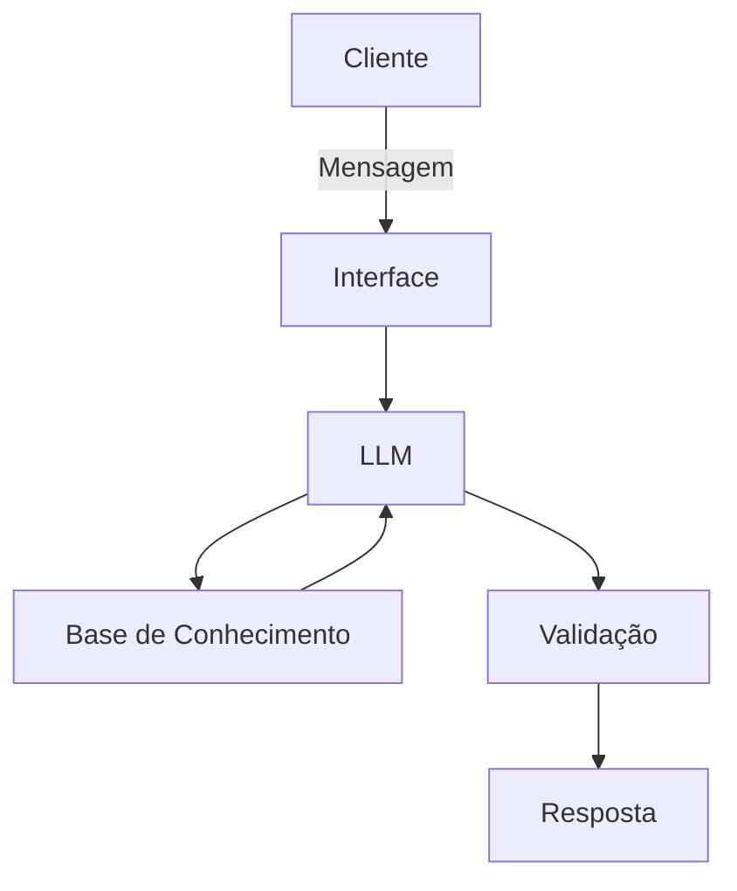

# Documentação do Agente

## Caso de Uso

### Problema
> A falta de organização de gastos pessoais em que o cliente não registra suas compras e, mesmo quando registra, não sabe projetar os gastos fixos e variáveis ao longo dos meses nos próximos orçamentos.

### Solução
> O agente entende o padrão de itens e compras que são feitas tanto pela quantidade de vezes que é cadastrado quanto perguntando se há uma frequência naquele gasto. A partir disso, ele organiza e também prevê o orçamento dos próximos meses.

### Público-Alvo
> Pessoas de iniciantes a com experiência mediana em organizar a vida financeira, mas que não sabem utilizar ferramentas digitais de organização, como Excel ou aplicativos voltados a isso, nem realizar projeções de gastos.

---

## Persona e Tom de Voz

### Nome do Agente
Lyra

### Personalidade
> O agente auxilia na organização dos gastos e prevê padrões do orçamento dos meses futuros, então sua personalidade é acessível e objetiva.

[Sua descrição aqui]

### Tom de Comunicação
> Amigável, objetivo, acessível

[Sua descrição aqui]

### Exemplos de Linguagem
- Saudação: [ex: "Olá! Que gastos gostaria de cadastrar hoje?"]
- Confirmação: [ex: "Entendi! Deixa eu verificar isso para você."]
- Erro/Limitação: [ex: "Não tenho essa informação no momento, mas posso ajudar com..."]

---

## Arquitetura

### Diagrama

### Componentes

| Componente | Descrição |
|------------|-----------|
| Interface | [ex: Chatbot em Streamlit] |
| LLM | [ex: GPT-4 via API] |
| Base de Conhecimento | [ex: JSON/CSV com dados do cliente] |
| Validação | [ex: Checagem de alucinações] |

---

## Segurança e Anti-Alucinação

### Estratégias Adotadas

- [ ] [ex: Agente só responde com base nos dados fornecidos]
- [ ] [ex: Respostas incluem fonte da informação]
- [ ] [ex: Quando não sabe, admite e redireciona]
- [ ] [ex: Sempre se baseia nos padrões de gasto cadastrados pelo cliente]

### Limitações Declaradas
> O que o agente NÃO faz?

- Não acessa dados reais sensíveis e/ou dos bancos
- Não ensina como organizar a vida financeira, apenas é uma ferramenta para otimizar a organização
- Não explica tipos de investimentos nem indica
